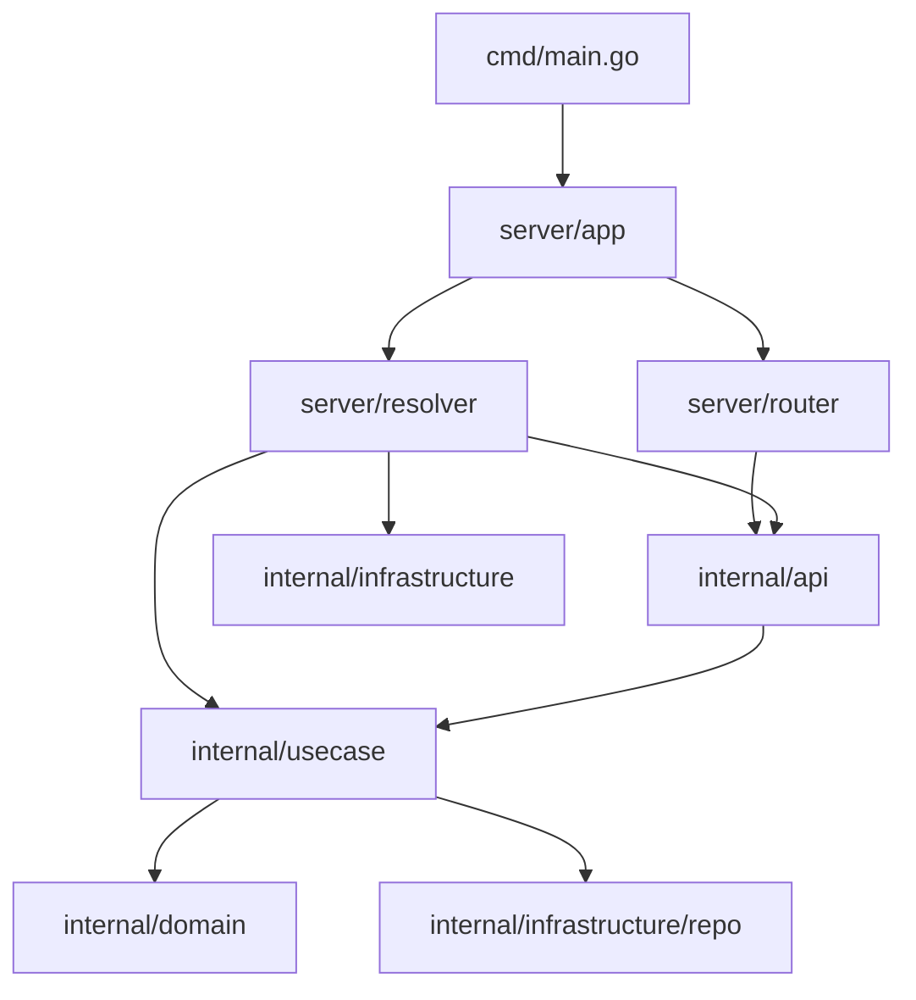

# Go Service Template — Clean Architecture

[](https://github.com/olx-india/go-service-template-clean-architecture/actions/workflows/ci.yml)
[](https://golang.org/dl/)
[](LICENSE)

An opinionated Go service **scaffold** following Clean Architecture. It provides layered structure, dependency injection, logging, optional OpenTelemetry, and sample HTTP endpoints with clear extension points—not a full production product.

## What is included vs what you add

| Included (wired) | You add in your fork |
|------------------|----------------------|
| Clean Architecture layers + DI resolver | Business logic in use cases |
| Gin HTTP server with graceful shutdown | Database / migrations |
| Structured logging (Zap) + request IDs | Auth, metrics |
| Optional OTLP tracing (`OTEL_ENABLED`) | Deployment manifests |
| Redis client + readiness probe | Rate limiting logic |
| Sample user + limit endpoints (stubs) | Your domain features |
| OpenAPI 3 via [go-swagger3](https://github.com/parvez3019/go-swagger3) + Swagger UI | |
| Unit + integration tests, linting, CI | |

Sample endpoints demonstrate **handler → use case → repository** wiring. Business logic is intentionally minimal—implement your domain in the use case layer.

## Architecture



Layers:

- **Domain** (`internal/domain/`) — entities and domain rules (no HTTP/DB imports)
- **Use case** (`internal/usecase/`) — application logic
- **Infrastructure** (`internal/infrastructure/`) — config, logging, Redis, repositories
- **API** (`internal/api/`) — HTTP handlers and DTOs
- **Server** (`server/`) — app lifecycle, routing, telemetry

See [docs/adr/001-clean-architecture-layers.md](docs/adr/001-clean-architecture-layers.md) for design rationale.

## Prerequisites

- Go 1.24.6+
- Docker and Docker Compose (for local stack)
- Make

## Quick start

### Use this template

1. Click **Use this template** on GitHub to create your repository.
2. Follow [docs/CUSTOMIZING.md](docs/CUSTOMIZING.md) to rename the module and strip sample features.

### Local development

```bash
git clone git@github.com:olx-india/go-service-template-clean-architecture.git
cd go-service-template-clean-architecture

make deps
cp .env.example .env
make run
```

Service: `http://localhost:8080`

### Docker Compose (app + Redis + Jaeger)

```bash
make compose-up    # start stack
make compose-down  # stop stack
```

## API endpoints

| Method | Path | Description |
|--------|------|-------------|
| GET | `/health` | Legacy health check |
| GET | `/live` | Liveness probe (always OK) |
| GET | `/ready` | Readiness probe (checks Redis when configured) |
| GET | `/swagger/index.html` | Interactive OpenAPI (Swagger UI) |
| POST | `/api/v1/user` | Create user (stub) |
| GET | `/api/v1/user/:id` | Fetch user by ID (stub) |
| POST | `/api/v1/limit/check` | Check rate limit (stub) |
| POST | `/api/v1/limit/reset` | Reset rate limit (stub) |

Example:

```http
GET /health
```

```json
{
  "status": "ok",
  "service": "go-service-template"
}
```

## Configuration

| Variable | Description | Default |
|----------|-------------|---------|
| `HOST` | Server host | `0.0.0.0` |
| `PORT` | Server port | `8080` |
| `REDIS_HOST` | Redis address | `localhost` |
| `ENV` | Environment name | `local` |
| `APP_NAME` | Application name | `go-service-template` |
| `READ_TIMEOUT` | HTTP read timeout | `60s` |
| `WRITE_TIMEOUT` | HTTP write timeout | `60s` |
| `OTEL_ENABLED` | Enable OpenTelemetry tracing | `false` |
| `OTLP_ENDPOINT` | OTLP gRPC endpoint | `localhost:4317` |
| `LOG_LEVEL` | Log level | `debug` |

When adding a database, consider [golang-migrate](https://github.com/golang-migrate/migrate)—this scaffold does not ship migrations.

## Testing and quality

```bash
make test        # all tests with -race and coverage
make lint        # golangci-lint
make format      # gofumpt
make vuln        # govulncheck
make swagger     # regenerate OpenAPI 3 spec (go-swagger3)
make pre-commit  # format + lint + test
make mock        # regenerate mocks (mockery)
```

## OpenAPI / Swagger

Handler godoc annotations are turned into an OpenAPI 3 document with [go-swagger3](https://github.com/parvez3019/go-swagger3). The generated file is embedded and served at `/swagger/index.html`.

```bash
make bin-deps    # install pinned tools (includes go-swagger3)
make swagger     # write docs/openapi/oas.json
make run         # UI at http://localhost:8080/swagger/index.html
```

After changing handler annotations or DTO tags, re-run `make swagger` and commit the updated `docs/openapi/oas.json`.

## Mock generation

Mocks are generated with [Mockery](https://vektra.github.io/mockery/):

```bash
make bin-deps   # install pinned tools from go.mod
make mock
```

## Project structure

```
├── cmd/                 # Application entry point
├── internal/
│   ├── api/             # HTTP handlers and DTOs
│   ├── domain/          # Business entities
│   ├── infrastructure/  # Config, logging, Redis, repos
│   └── usecase/         # Application logic
├── integrationtests/    # HTTP integration tests
├── server/              # App, router, resolver, telemetry
├── docs/                # Adopter docs + embedded OpenAPI spec
└── docker-compose.yml
```

## OpenTelemetry

Tracing is **disabled by default**. Enable when Jaeger or another OTLP collector is available:

```bash
OTEL_ENABLED=true
OTLP_ENDPOINT=localhost:4317
```

Docker Compose sets `OTEL_ENABLED=true` and points to Jaeger. View traces at `http://localhost:16686`.

## Extending the template

- [docs/CUSTOMIZING.md](docs/CUSTOMIZING.md) — rename module, strip samples, first feature
- [docs/EXTENDING.md](docs/EXTENDING.md) — optional additions (DB, metrics, auth)
- [CONTRIBUTING.md](CONTRIBUTING.md) — contributor workflow

## Contributing

See [CONTRIBUTING.md](CONTRIBUTING.md). Please read our [Code of Conduct](CODE_OF_CONDUCT.md).

## Security

Report vulnerabilities privately—see [SECURITY.md](SECURITY.md).

## License

This project is licensed under the Apache License 2.0—see [LICENSE](LICENSE) for details.
